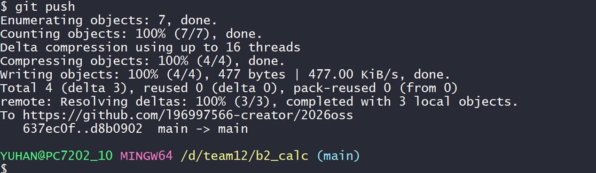
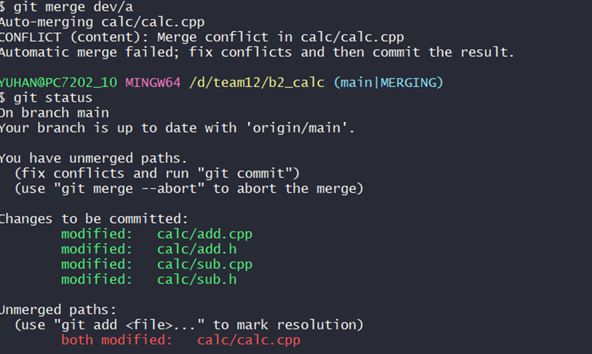
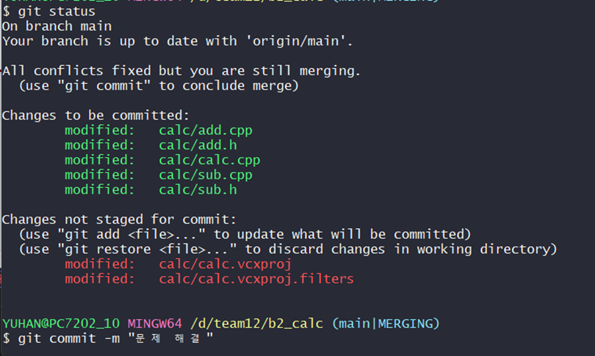
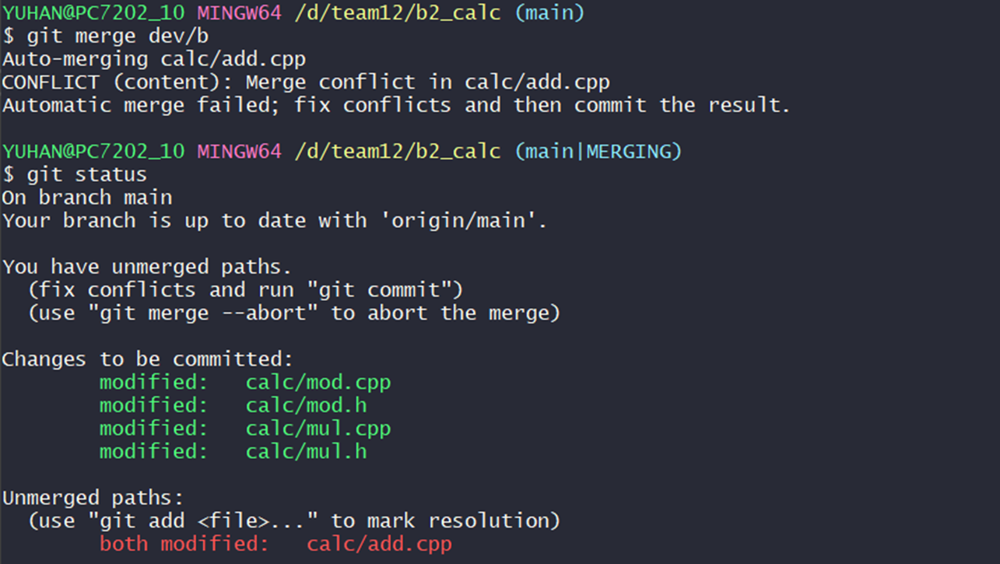
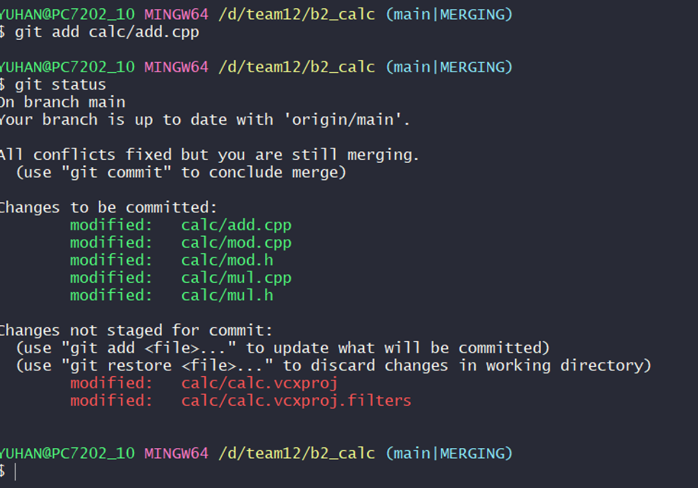
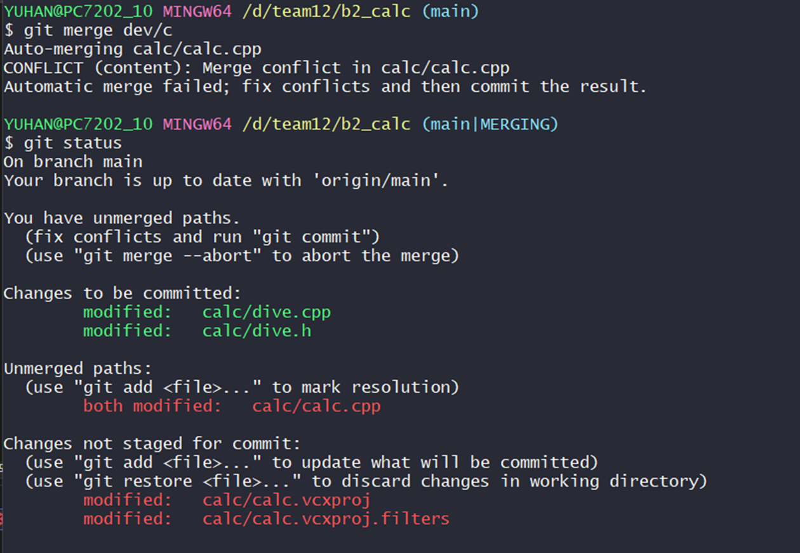
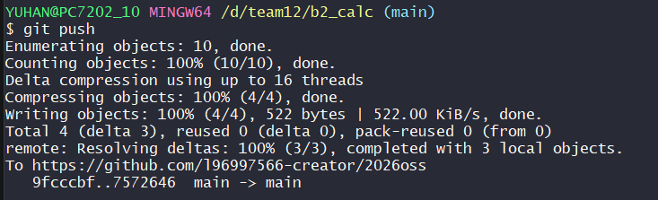
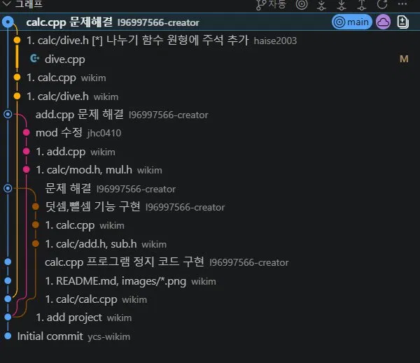
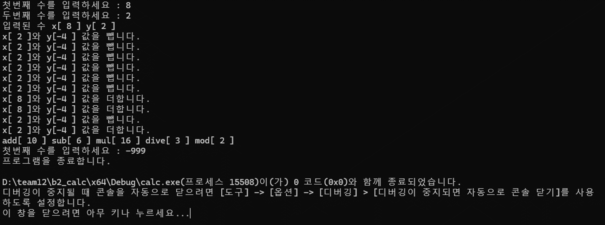

# 2026oss

오픈소스 소프트웨어 기말고사 문제

## calc

oss 기말 프로젝트 
저장소:https://github.com/l96997566-creator/2026oss
## 팀원(역할)    업무

이상욱(팀장 - 202507031)   dev/a 브랜치와 main 브랜치 수정 
하승종(팀원 - 202207013)  dev/c 브랜치 수정 
정현창(팀원 - 202307069)  dev/b 브랜치 수정 

## 문제해결 방법과 순서

1.팀원들이 각자 코드 수정 
2.충돌 발생(dev/a) 
3.충돌 해결 
4.충돌 발생(dev/b) 
5.충돌 해결 
6.충돌 발생(dev/c) 
7.충돌 해결 
8.git flow 
9.최종 화면 

## 중간과정 스크린샷

1. 팀원들이 각자 코드를 수정 

2. 충돌 발생 화면 

3. 충돌 해결 후 화면 

4. 충돌 발생 화면 

5. 충돌 해결 후 화면 

6. 충돌 발생 화면 

7. 충돌 해결 후 화면 

8. git flow 

9. 최종 프로젝트 화면 
